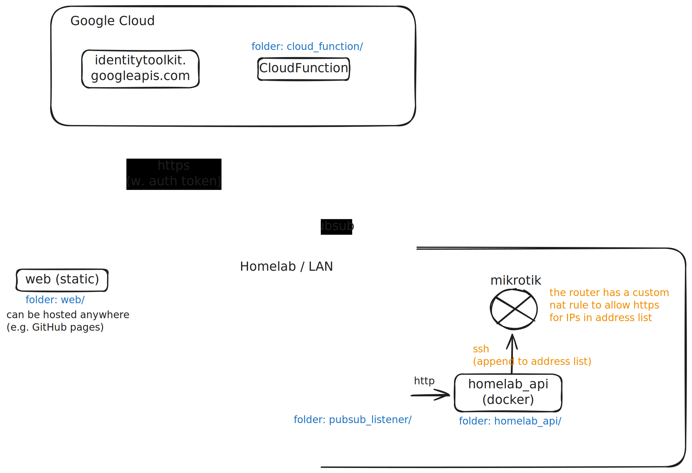

# Readme for Homelab dispatcher

## Overview

This show cases the first flow I've implemented which allows anyone authorized to punch a "hole" through my firewall so they can access my webserver.

As you can see from the diagram, there is no open firewall port until the action is triggered through a Google Cloud Function.

Afterwards, only their specific IP will be allowed through the firewall.



Here is the rule I have on the Mikrotik router (running RouterOS):

```
/ip firewall nat add action=dst-nat chain=dstnat dst-port=443 in-interface=wan log=yes protocol=tcp src-address-list=wan-https-allowlist to-addresses={local_webserver_ip} to-ports=443
```


## Installation Steps (after `git clone`)

1. Add your SSH keys to the `./ssh` directory (or create new ones with `ssh-keygen`).
2. Authorize the public SSH key on the Mikrotik device.
3. Copy the `.env_template` to `.env` and update its values to match your environment
4. Download a credential file for your service account from the [cloud console](https://console.cloud.google.com/iam-admin/serviceaccounts).
5. Reference the downloaded credential file in your `compose.yaml` file.
6. Start the container e.g `docker build . && docker compose up -d` (alternatively, `just docker-up` if you have [just.env](https://just.systems/))

### Alternative for Max 🚀

This should be enough to populate everything after git clone:

```shell
just max-init-secrets
just docker-up
```


## Important notes

This is meant to be the first step of a more complex dispatcher (supporting more than just one command). Syncing to a newer version of the repo may break you.
